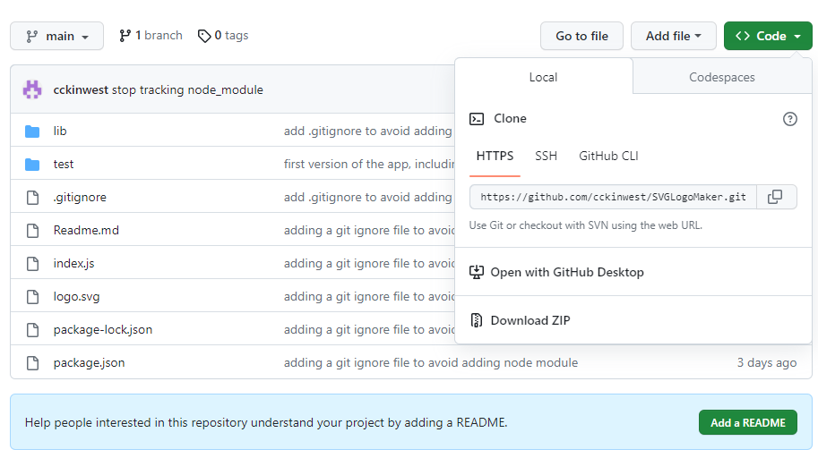
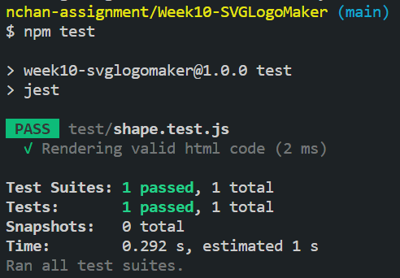
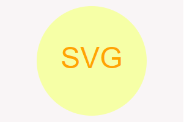
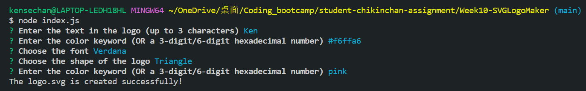

# SVG Logo maker

This task is to build a Node.js command-line application that takes in user input to generate a logo and save it as an SVG file. The application prompts the user to select a color and shape, provide text for the logo, and save the generated SVG to a .svg file.

## Packages used

Inquirer (version 8.2.4) is used to prompt queries whose answers are used for creating logo. Jest (version 29.5.0) is used to test the app automatically. css-color-keywords (version 1.0.0) is used to give a list of color keywords for checking.

## Installation

To install the app, clone all the files from [cckinwest's github](https://github.com/cckinwest/SVGLogoMaker/) and put into the same folder, then type 'npm i' in the terminal to install all the required packages:

## Test

To test, just type 'npm test' in the terminal:

## Sample Logo created

A logo of size 300 X 200 pixel is created:

## Usage

Type 'node index.js' in the terminal, then answer five simple questions, a logo will be created.
For the color queries, both color keywords (e.g. white, pink, yellow) and hexadecimal numbers (e.g. A45, ffffff, #bde) are accepted.

## Video Walkthrough

[Link to the video walkthrough](https://drive.google.com/file/d/1_6iVa6kiY6ilqGzgWyuAWLh715XnnfdM/view)
